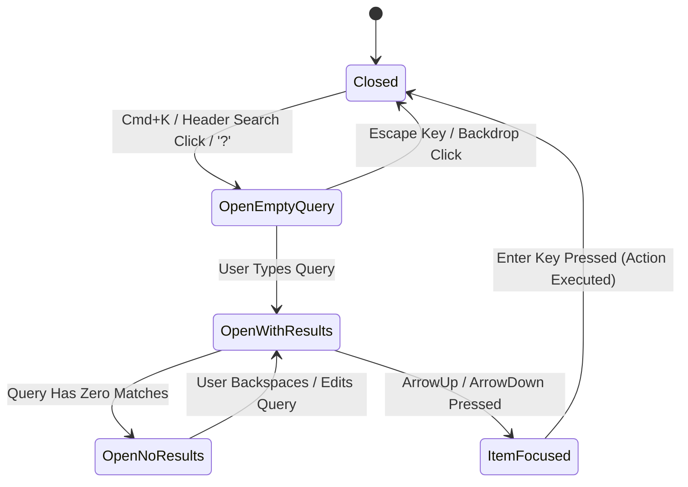

# Command-Palette & Help Search Specification (Cmd/Ctrl+K)

**Document Version:** 1.0.0  
**Target Component:** Command Palette & Help Search Modal (`KeyboardShortcutsModal.tsx`, `AppNavbar.tsx`, `commandPaletteData.ts`)  
**Compliance Standard:** WCAG 2.1 Level AA  
**Status:** Ready for Engineering Handoff  

---

## 1. Executive Overview & Design Intent

As Fluxora's treasury streaming application expands with recipient claims, active stream management, and voice accessibility controls, users require a fast, unified search interface to navigate features, inspect keyboard shortcuts, and access help documentation.

The **Command-Palette & Help Search Modal** (`Cmd/Ctrl+K`) supersedes the legacy static shortcuts modal by combining:
1. **Global Action Search:** Instantly jump to Dashboard, Streams, Recipient views, initiate stream creation, or withdraw capital.
2. **Searchable Keyboard Shortcuts Reference:** Live, searchable keyboard shortcut dictionary wrapping all application keybindings.
3. **Help & Documentation Search:** Searchable help articles covering streaming accrual mechanics, wallet setup, and withdrawal rules.

---

## 2. Trigger Affordances & Global Shortcuts

The palette can be invoked via three independent affordances:

| Trigger Method | Input Action | Target Viewport | Target Behavior |
| :--- | :--- | :--- | :--- |
| **Header Button** | Click search bar in `AppNavbar.tsx` | All Viewports | Dispatches `open-command-palette` CustomEvent |
| **Keyboard Shortcut** | `Cmd+K` (Mac) or `Ctrl+K` (Win/Linux) | All Viewports | Opens palette, focuses search input |
| **Quick Key** | `?` (Shift + `/`) | Unfocused inputs only | Opens palette, focuses search input |
| **Dismissal** | `Escape` Key or Backdrop Click | Active Palette | Closes modal, restores focus to trigger element |

---

## 3. Operational States & Grouped Result Categories

The Command Palette operates across **5 distinct UI states**:



### 3.1 State Definitions & Behavior

| State Name | Query Input | Displayed Contents | User Navigation Controls |
| :--- | :--- | :--- | :--- |
| **Closed** | `""` | Modal unmounted | N/A |
| **Open-Empty-Query**| `""` | Suggested & Frequent Actions + Quick Shortcuts | `ArrowDown`/`ArrowUp` to navigate, `Enter` to run |
| **Open-With-Results**| Matches text | Grouped sections: **Actions**, **Shortcuts**, **Help** | Filtered dynamically per keystroke |
| **Open-No-Results** | Unmatched | Empty state illustration + search tips | Backspace to edit or `Escape` to close |
| **Item-Focused** | Active query | Focused item highlighted with left accent bar | `aria-selected="true"`, `aria-activedescendant` updated |

---

## 4. Grouped Category Structure & Data Dictionary

Results are organized into three clear, icon-annotated categories defined in `src/components/commandPaletteData.ts`.

### 4.1 Categories & Examples

| Category | Icon Token | Items Included | Primary Target |
| :--- | :--- | :--- | :--- |
| **Actions** | `<Zap />` | Create Stream, Jump to Dashboard, Jump to Streams, Jump to Recipient, Withdraw Capital, Toggle Theme | Executes route navigation or state change |
| **Shortcuts** | `<Keyboard />` | `Cmd+K` Palette, `?` Shortcuts, `Esc` Dismiss, `↑/↓` Navigate, `Enter` Select | Displays formatted `<kbd>` key badges |
| **Help** | `<BookOpen />` | Continuous Capital Streaming Guide, Stellar Wallet Setup, Recipient Withdrawal Rules, Vesting & Cliffs | Opens documentation article or view |

---

## 5. Responsive Mobile & Desktop Layout

```
Desktop Layout (>= 768px)               Mobile Layout (< 768px)
+-------------------------------+      +-------------------------------+
| AppNavbar                     |      | AppNavbar                     |
|                               |      |                               |
|    +---------------------+    |      |                               |
|    | Command Palette     |    |      |                               |
|    | (Centered, 75vh max)|    |      | +---------------------------+ |
|    +---------------------+    |      | | Mobile Bottom Sheet       | |
|                               |      | | (Full Width, 90vh max)    | |
+-------------------------------+      | +---------------------------+ |
                                       +-------------------------------+
```

- **Desktop (`>= 768px`):** Centered floating dialog (`max-w-2xl`, `max-h-[75vh]`).
- **Mobile (`< 768px`):** Docked bottom sheet (`w-full`, `rounded-t-2xl`, `max-h-[90vh]`) keeping the search input fixed at top for easy thumb reachability.

---

## 6. WCAG 2.1 AA Contrast & Accessibility Verification

### 6.1 ARIA Annotations & Semantics
- **Container:** `role="dialog"`, `aria-modal="true"`, `aria-label="Command Palette and Help Search"`.
- **Search Input:** `aria-expanded="true"`, `aria-controls="command-palette-results"`, `aria-activedescendant={focusedItem.id}`.
- **Results List:** `id="command-palette-results"`, `role="listbox"`, `aria-label="Command palette search results"`.
- **Result Item:** `id={item.id}`, `role="option"`, `aria-selected={isFocused}`.
- **Screen Reader Announcer:** `<div className="sr-only" aria-live="polite">` announcing result count.
- **Focus Management:** Wrapped in `useModalAccessibility.ts` for automatic focus trap and focus restoration to the trigger element upon closing.

### 6.2 Contrast Matrix

| Element Pair | Foreground | Background | Contrast Ratio | WCAG AA Requirement | Result |
| :--- | :--- | :--- | :--- | :--- | :--- |
| **Search Input Text** | `#E8ECF4` | `#0A0E17` (Dark) | **14.8:1** | **>= 4.5:1** | **PASS** |
| **Item Title (Default)** | `#1A1F36` | `#FFFFFF` (Light) | **12.4:1** | **>= 4.5:1** | **PASS** |
| **Item Title (Focused)** | `#00B8D4` | `#00B8D4`/10 Tint | **5.2:1** | **>= 4.5:1** | **PASS** |
| **Focus Indicator Ring** | `#00B8D4` | Surface Tint | **3.8:1** | **>= 3.0:1** (Non-text) | **PASS** |
| **Key Badge `<kbd>`** | `#E8ECF4` | `#192436` | **10.2:1** | **>= 4.5:1** | **PASS** |

---

## 7. Quality Assurance & Test Coverage

- **Test Suite Location:** `src/components/__tests__/CommandPaletteModal.test.tsx`
- **Test Scenarios:**
  1. Opens via custom event `open-command-palette`.
  2. Opens via `Cmd+K` keyboard shortcut.
  3. Displays suggested actions in empty query state.
  4. Dynamically filters items into Actions, Shortcuts, and Help sections.
  5. Renders friendly no-results state when search query matches nothing.
  6. Navigates options via `ArrowDown`/`ArrowUp` and executes item on `Enter`.
  7. Closes modal on `Escape` key press.
