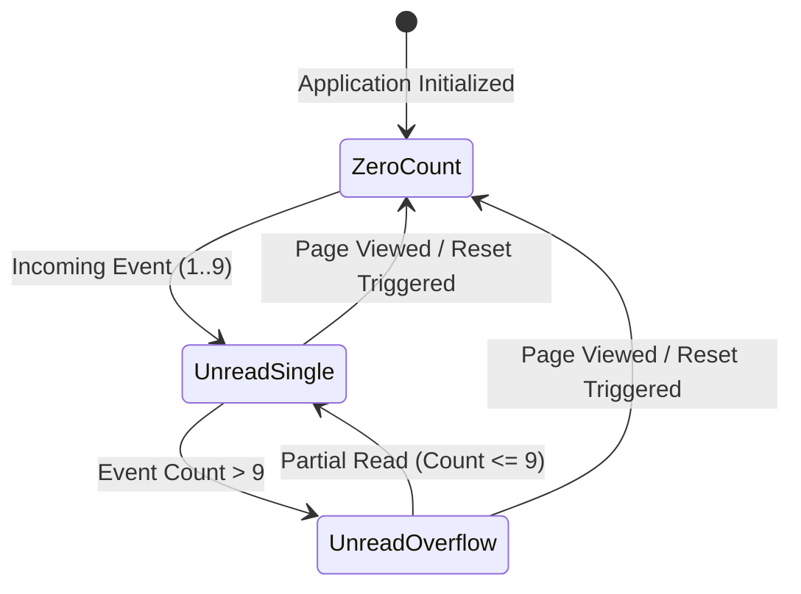

# Dynamic Favicon Count Badge Specification

**Document Version:** 1.0.0  
**Target:** Dynamic Favicon & In-Page Ambient Unread Status Indicator  
**Compliance Standard:** WCAG 2.1 Level AA  
**Status:** Ready for Engineering Handoff  

---

## 1. Executive Overview & Design Intent

In continuous treasury streaming workflows, users often keep Fluxora open in background browser tabs while performing other tasks. The **Dynamic Favicon Count Badge** functions as an ambient status indicator that overlays unread event counts (e.g., incoming stream creations, milestone alerts, or recipient updates) onto the base Fluxora icon in the browser tab.

### Core Objectives
1. **Background Visibility:** Provide clear visual feedback of unread events without requiring tab focus.
2. **Icon Legibility:** Preserve base Fluxora brand mark recognition across light, dark, and custom browser tab themes.
3. **Accessibility First (WCAG 2.1 AA):** Ensure the badge is a supplementary visual cue only. The identical count is always rendered as accessible, screen-reader-friendly text in-page.
4. **Fallback & Mobile Parity:** Provide robust fallbacks for mobile viewports and browsers where dynamic favicon DOM manipulation is constrained.

---

## 2. Badge Composition & Redline Specifications

Favicons are rendered by browser tabs at 16x16px (standard display) or 32x32px (high-DPI / Retina displays). To maintain crisp text legibility, the dynamic canvas is drawn natively at **32x32px** (2x scale).

### 2.1 Canvas Coordinates & Badge Alignment (32x32px Canvas)

```
+--------------------------------+
| (0,0)                (23,9)    |
|   +----+            /-----\    |
|   | TL |           |  9+   |   | <- Badge Overlay (Top-Right)
|   +----+            \-----/    |
|                      (32,16)   |
|                                |
|   +----+            +----+     |
|   | BL |            | BR |     |
|   +----+            +----+     |
|                        (32,32) |
+--------------------------------+
```

| Scale | Aspect | Base Icon Bounding Box | Badge Center (1-9) | Badge Center (9+) | Badge Radius / Size |
| :--- | :--- | :--- | :--- | :--- | :--- |
| **32x32px** | Retina (2x) | `(0, 0, 32, 32)` | `(23px, 9px)` | `(21px, 9px)` | `r = 6.5px` (Circle) / `18x13px` (Pill) |
| **16x16px** | Standard | `(0, 0, 16, 16)` | `(11.5px, 4.5px)` | `(10.5px, 4.5px)` | `r = 3.25px` (Circle) / `9x6.5px` (Pill) |

---

## 3. Visual Tokens & Contrast Matrix

All colors adhere to the Fluxora Design Token system (`src/design-tokens.css`).

### 3.1 Design Tokens

| Token Category | Token Reference | HEX Value | Purpose |
| :--- | :--- | :--- | :--- |
| **Badge Fill** | `--color-danger` | `#DC2626` (Red-600) | Primary unread alert background |
| **Badge Text** | `--color-text-inverse` | `#FFFFFF` (White) | High-contrast numeric digit |
| **Isolation Ring**| `--surface-base` / Dark | `#090D16` | 1.5px outer stroke isolating badge from tab/logo |
| **Base Icon Stroke**| `--color-accent-primary`| `#00B8D4` (Cyan) | Fluxora brand geometric mark |

### 3.2 WCAG 2.1 AA Contrast Verification

| Element Pair | Foreground | Background | Contrast Ratio | WCAG 2.1 AA Result |
| :--- | :--- | :--- | :--- | :--- |
| **Badge Text vs Fill** | `#FFFFFF` | `#DC2626` | **5.71 : 1** | **PASS** (Exceeds 4.5:1 minimum) |
| **Isolation Ring vs Fill**| `#090D16` | `#DC2626` | **10.42 : 1** | **PASS** (Clear boundary definition) |
| **Isolation Ring vs Tab**| `#090D16` | `#FFFFFF` (Light Tab) | **18.84 : 1** | **PASS** |
| **Isolation Ring vs Tab**| `#090D16` | `#1A1F2C` (Dark Tab) | **4.82 : 1** | **PASS** |

---

## 4. State Machine & Count Lifecycle



### 4.1 State Matrix

| State Name | Count Range | Favicon Output | In-Page Sidebar Badge | Accessibility Label (`aria-label`) |
| :--- | :--- | :--- | :--- | :--- |
| **Zero-Unread** | `count === 0` | Clean base icon (`Icon.svg`) | Hidden (`display: none`) | `""` (No unread alert) |
| **Single Digit** | `1 <= count <= 9` | Red circle badge with `1`..`9` | Red pill badge with `1`..`9` | `"{count} unread events"` |
| **Overflow State**| `count > 9` | Red pill badge with `"9+"` | Red pill badge with `"9+"` | `"More than 9 unread events"` |
| **Reset-on-View**| View opened | Canvas cleared, restored to clean | Hidden on view activation | Reset event dispatched |

---

## 5. In-Page Fallback & Accessibility Annotations

Favicons are strictly a **supplementary ambient visual cue**. Screen readers do not parse dynamic tab favicons. Furthermore, mobile operating systems (iOS Safari, Android Chrome) frequently hide tab favicons entirely in tab overview mode.

### 5.1 In-Page Fallback Requirements
1. **Sidebar Navigation Item:** The paired in-page unread badge is rendered on `Sidebar.tsx`'s navigation item (e.g., `Recipient` or `Streams`).
2. **Keyboard Reachability:** The in-page badge is contained within the focusable `<NavLink>`, ensuring keyboard users (`Tab` / `Shift+Tab`) encounter the badge during standard navigation.
3. **Screen Reader Announcement:** The badge element contains descriptive text or `aria-label` attributes (`aria-label="3 unread events"`).
4. **Mobile Layout:** On mobile viewports (< 768px), the in-page badge remains fully visible inside the mobile drawer menu.

---

## 6. Engineering Implementation Guide

### 6.1 Module Architecture
- **Utility Location:** `src/utils/faviconBadge.ts`
- **DOM Integration:** `index.html` contains `<link rel="icon" type="image/svg+xml" href="/src/public/Icon.svg" id="favicon" />`
- **React Hook:** `useFaviconBadge(count: number)` for declarative lifecycle synchronization.

### 6.2 Synchronous Canvas Generation Code Pattern
```typescript
import { generateFaviconDataUrl, updateFaviconBadge } from "../utils/faviconBadge";

// Imperative update call
updateFaviconBadge(unreadCount);

// Declarative React Hook call
useFaviconBadge(unreadCount);
```

---

## 7. Testing & Quality Assurance Summary

1. **Unit Test Suite:** `src/utils/__tests__/faviconBadge.test.ts` (100% coverage on count formatting, canvas generation, DOM updates, and reset behavior).
2. **Integration Test Suite:** `src/components/__tests__/Sidebar.faviconBadge.test.tsx` (Validates in-page badge rendering, `9+` overflow, accessibility `aria-label`, and click reset handler).
3. **Visual Contrast Check:** Verified via `contrastUtils.ts` (Badge text contrast `#FFFFFF` on `#DC2626` = 5.71:1).
