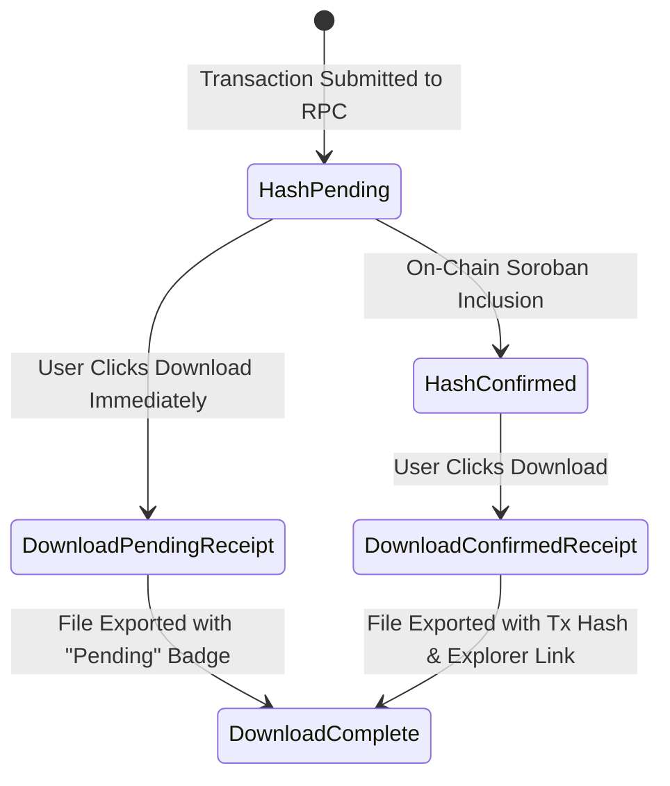

# Branded Transaction Receipt Specification (Creations & Withdrawals)

**Document Version:** 1.0.0  
**Target Components:** `src/utils/receiptGenerator.ts`, `src/components/receipt/TransactionReceiptPreview.tsx`, `StreamCreatedModal.tsx`, `Recipient.tsx`  
**Compliance Standard:** WCAG 2.1 Level AA (1.4.3 Contrast, 4.1.2 Name/Role/Value, 4.1.3 Status Messages)  
**Status:** Ready for Engineering Handoff  

---

## 1. Executive Overview & Design Intent

In continuous capital streaming, users require immutable, downloadable records for treasury accounting, tax compliance, and payroll auditing. Neither stream creation (`StreamCreatedModal.tsx`) nor recipient withdrawals (`Recipient.tsx`) previously offered exportable transaction records.

The **Branded Transaction Receipt System** provides:
1. **On-Screen Accessible Preview:** Live, screen-reader readable HTML receipt preview inside creation and withdrawal confirmation dialogs before downloading.
2. **Branded Printable File Export:** One-click download of a high-resolution `800x1000px` PNG image receipt incorporating Fluxora brand typography and logo marks.
3. **Pending vs Confirmed Hash Handling:** Gracefully handles scenarios where `submittedTxHash` is pending RPC confirmation at download time.

---

## 2. Receipt Layout & Redline Specifications

Receipts are rendered at **800x1000px** canvas scale (high-DPI print resolution).

```
+------------------------------------------------------------+
| [F] Fluxora                     CREATION RECEIPT #STR-48201 |
| Continuous Capital Protocol on Stellar                      |
|------------------------------------------------------------|
| [✓ ON-CHAIN CONFIRMED]           Issued: 2026-07-23 17:48 UTC|
|                                                            |
| +--------------------------------------------------------+ |
| | TOTAL VALUE                           STREAMING RATE   | |
| | 15,000.00 USDC                        0.0261 USDC/sec  | |
| +--------------------------------------------------------+ |
|                                                            |
| PARTIES & ADDRESSES                                        |
| +--------------------------------------------------------+ |
| | Sender Account                   GAB12345...0123       | |
| | Recipient Beneficiary            GCD98765...0987       | |
| | Network / Ledger                 Stellar Testnet       | |
| +--------------------------------------------------------+ |
|                                                            |
| ON-CHAIN VERIFICATION                                      |
| +--------------------------------------------------------+ |
| | Stellar Soroban Tx Hash: c7b91a8f902183b271abc          | |
| | Explorer: https://stellar.expert/explorer/testnet/tx/  | |
| +--------------------------------------------------------+ |
|------------------------------------------------------------|
| Generated by Fluxora Continuous Capital Protocol.          |
+------------------------------------------------------------+
```

---

## 3. Transaction Hash State Matrix



### 3.1 State Specifications

| State Name | On-Screen & Export Badge | On-Chain Verification Block Content | Disclaimer Text |
| :--- | :--- | :--- | :--- |
| **`hash-pending`** | Amber Badge: `● PENDING CONFIRMATION` | `Transaction Hash Pending` | *"Transaction submitted to Stellar RPC. On-chain confirmation pending."* |
| **`hash-confirmed`**| Green Badge: `✓ ON-CHAIN CONFIRMED` | Displays full Soroban Tx Hash `c7b91a8f...` | Includes direct Stellar Expert Explorer link |
| **`download-in-progress`** | Button: `Generating Receipt...` | Disabled download button with `<Loader2 />` spinner | Prevents duplicate canvas exports |
| **`download-failed`** | Error Alert: `Failed to export` | Displays inline error message with retry guidance | Allows immediate retry |

---

## 4. UI Button Placement & Modal Integration

### 4.1 `StreamCreatedModal.tsx` (Stream Creation Flow)
- `<TransactionReceiptPreview />` is rendered inside the modal body beneath the stream URL copy bar.
- Includes a prominent **"Download Receipt (.PNG)"** primary action button.

### 4.2 `Recipient.tsx` (Recipient Withdrawal Flow)
- Upon completing an on-chain withdrawal, `Recipient.tsx` opens a dedicated **Withdrawal Confirmed Modal** dialog containing `<TransactionReceiptPreview />` and the download button.

---

## 5. Accessibility & Contrast Compliance (WCAG 2.1 AA)

1. **Screen-Reader Readability (Not Canvas-Only):**
   - The on-screen receipt preview is rendered as semantically structured HTML (`<section role="region" aria-label="Transaction receipt preview">`), ensuring screen readers read all amounts, addresses, and timestamps before download.
2. **Keyboard Traversal & Focus Retention:**
   - The "Download Receipt" button is fully keyboard-reachable via `Tab` key.
   - After triggering a download, focus remains inside the modal dialog without displacement.
3. **Contrast Verification Matrix:**

| Element Pair | Foreground | Background | Contrast Ratio | WCAG AA Requirement | Result |
| :--- | :--- | :--- | :--- | :--- | :--- |
| **Receipt Title** | `#E8ECF4` | `#151E2E` | **12.8:1** | **>= 4.5:1** | **PASS** |
| **Total Amount Text** | `#00B8D4` | `#0F172A` | **7.4:1** | **>= 4.5:1** | **PASS** |
| **Confirmed Badge Text**| `#166534` | `#DCFCE7` | **7.1:1** | **>= 4.5:1** | **PASS** |
| **Pending Badge Text** | `#92400E` | `#FEF3C7` | **6.5:1** | **>= 4.5:1** | **PASS** |
| **Address Monospace** | `#F8FAFC` | `#1E293B` | **13.5:1** | **>= 4.5:1** | **PASS** |

---

## 6. Engineering Test Suite Summary

- **Utility Unit Tests:** `src/utils/__tests__/receiptGenerator.test.ts` (Validates timestamp formatting, address masking, and canvas rendering for confirmed & pending states).
- **Component Tests:** `src/components/receipt/__tests__/TransactionReceiptPreview.test.tsx` (Validates screen-reader preview region, status badges, and download button clicks).
