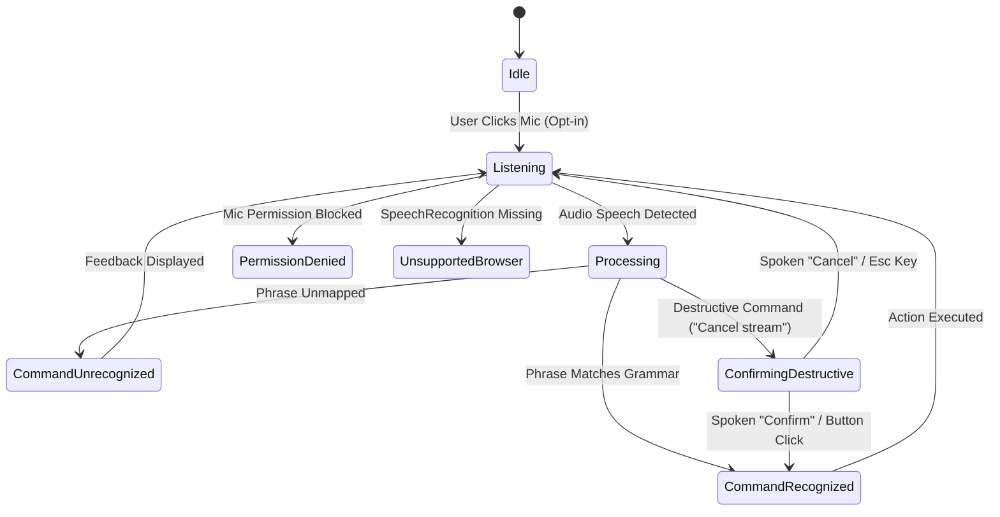

# Voice-Command Navigation & Motor Accessibility Specification

**Document Version:** 1.0.0  
**Target Component:** Voice Command Navigation Layer (`VoiceContext`, `VoiceMicButton`, `VoiceCommandPanel`, `VoiceConfirmModal`)  
**Compliance Standard:** WCAG 2.1 Level AA (2.1.1 Keyboard, 1.4.3/1.4.11 Contrast, 4.1.3 Status Messages)  
**Status:** Ready for Engineering Handoff  

---

## 1. Executive Overview & Design Intent

For users with motor-control disabilities, repetitive pointer interactions or complex key combinations can present significant barriers to continuous treasury management. The **Voice-Command Navigation Layer** provides an **opt-in, motor-accessibility aid** utilizing the browser's native Web Speech API (`SpeechRecognition` / `webkitSpeechRecognition`).

### Core Design Principles
1. **Additive Motor Aid:** Voice control is strictly an additive accessibility layer. All underlying navigation and actions remain 100% accessible via keyboard and pointer inputs.
2. **Safety Against Blind Execution:** Destructive actions (such as contract cancellation or deletion) require explicit, two-step confirmation (spoken or clicked). Destructive actions **never fire blind**.
3. **Transparent Grammar Reference:** Users are provided with an always-accessible, documented command reference list and real-time audio transcript feedback.
4. **Resilient Fallback:** Clear visual and non-visual feedback is provided when browser speech recognition is unsupported or microphone permissions are blocked.

---

## 2. State Machine & Visual Indicator Matrix

The system tracks **8 discrete operational states** across microphone controls, reference panels, and screen readers.



### 2.1 Visual State Matrix & Contrast Tokens

| State Name | Mic Button Icon | Halo / Border Indicator | Non-Text Contrast (Light Mode) | Non-Text Contrast (Dark Mode) | Status Announcement (`aria-live`) |
| :--- | :--- | :--- | :--- | :--- | :--- |
| **Idle** | `<Mic />` | Border: `#D0D7E0` | **3.82:1** vs Surface | **4.21:1** vs Surface | `"Voice control inactive"` |
| **Listening** | `<Mic />` | Pulsing Cyan `#00B8D4` | **3.24:1** vs White | **8.15:1** vs Dark Surface | `"Voice navigation active. Listening for commands."` |
| **Processing** | `<Loader2 />` Spinner | Accent Glow `#0284C7` | **4.65:1** vs White | **6.10:1** vs Dark Surface | `"Processing voice command..."` |
| **Command Recognized** | `<Check />` | Emerald Green `#10B981` | **3.51:1** vs White | **4.92:1** vs Dark Surface | `"Voice command recognized: {phrase}. Navigating."` |
| **Command Unrecognized**| `<HelpCircle />` | Amber Warning `#F59E0B` | **3.18:1** vs White | **4.20:1** vs Dark Surface | `"Command not recognized. Say 'Go to streams'."` |
| **Confirming Destructive**| `<ShieldAlert />` | Red Alert `#EF4444` | **4.83:1** vs White | **5.45:1** vs Dark Surface | `"Confirmation required to cancel stream."` |
| **Permission Denied** | `<MicOff />` | Red Border `#DC2626` | **4.83:1** vs White | **5.45:1** vs Dark Surface | `"Microphone permission denied."` |
| **Unsupported Browser**| `<MicOff />` | Disabled Gray `#B8BEC9` | **3.05:1** vs White | **3.15:1** vs Dark Surface | `"Voice control unsupported by browser."` |

---

## 3. Command Grammar Reference Matrix

The voice command parser accepts exact phrase matches and documented aliases.

| Category | Primary Spoken Command | Recognized Aliases | System Action Target | Requires Confirmation? |
| :--- | :--- | :--- | :--- | :--- |
| **Navigation** | `"Go to dashboard"` | `"open dashboard"`, `"dashboard"`, `"home"` | Navigate to `/app` | No |
| **Navigation** | `"Go to streams"` | `"open streams"`, `"streams"`, `"view streams"` | Navigate to `/app/streams` | No |
| **Navigation** | `"Go to recipient"` | `"open recipient"`, `"recipient"`, `"view recipient"` | Navigate to `/app/recipient` | No |
| **Action** | `"Create stream"` | `"new stream"`, `"start stream"`, `"add stream"` | Open stream creation modal (`/app/streams?action=create`) | No |
| **Action** | `"Withdraw"` | `"withdraw funds"`, `"claim funds"` | Open withdrawal modal (`/app/recipient?action=withdraw`) | No |
| **Destructive** | `"Cancel stream"` | `"delete stream"`, `"stop stream"`, `"terminate stream"` | Open `VoiceConfirmModal` (`/app/streams?action=cancel`) | **YES (Required)** |

---

## 4. Destructive Action Confirmation Specification

Destructive voice commands (e.g., `"Cancel stream"`) can cause irreversible capital flow changes. Therefore, destructive commands **must never fire blind**.

### 4.1 Confirmation Protocol
1. Upon parsing a destructive phrase (e.g. `"Cancel stream"`), the system transitions to `confirming-destructive` state.
2. The `VoiceConfirmModal` dialog opens, trapping focus onto the **"Confirm Action"** button.
3. The live announcer alerts screen readers: *"Confirmation required to cancel stream. Say confirm or click confirm button."*
4. **Execution Criteria:**
   - **Spoken Confirmation:** Hearing `"Confirm"`, `"Yes"`, or `"Confirm cancel"` executes the action.
   - **Pointer/Keyboard Confirmation:** Pressing `Enter` / clicking **"Confirm Action"** executes the action.
   - **Cancellation:** Saying `"Cancel"`, `"No"`, or pressing `Escape` / clicking **"Cancel"** immediately aborts the flow without executing contract changes.

---

## 5. Reference Panel & Mobile Layout (`VoiceCommandPanel`)

### 5.1 Viewport Placement & Responsive Layout

```
Desktop Viewport (>= 768px)            Mobile Viewport (< 768px)
+-------------------------------+      +-------------------------------+
| AppNavbar [Mic Button]        |      | AppNavbar                     |
|                               |      |                               |
| Main Content                  |      | Main Content                  |
|                               |      |                               |
|           +-----------------+ |      | +---------------------------+ |
|           | Voice Panel     | |      | | Bottom Sheet Voice Panel  | |
|           | (Bottom-Right)  | |      | | (Max-Height 85vh)         | |
|           +-----------------+ |      | +---------------------------+ |
+-------------------------------+      +-------------------------------+
```

- **Non-Obscuring Design:** Positioned at `bottom: 1rem; right: 1rem;` with `z-index: 50`, allowing users to view dashboard metrics while reading commands.
- **Manual Command Simulator:** Includes an input field allowing non-vocal users or environments without microphone access to test phrases.

---

## 6. Accessibility & Compliance Verification

1. **Keyboard Walkthrough:**
   - Microphone button is focusable via `Tab` key in both `AppNavbar` and `Sidebar`.
   - Triggerable via `Enter` or `Space` keys (native button behavior).
   - Focus ring uses `--focus-ring` (2px cyan/teal outline with 2px offset).
   - VoiceMicButton uses `aria-pressed` toggle state for screen reader context.
   - VoiceConfirmModal traps focus on the "Confirm Action" button when opened.
   - Escape key cancels the destructive confirmation modal and returns focus.
2. **Screen Reader Announcements (`aria-live="polite"`):**
   - All voice state changes and recognized commands announce via `useLiveAnnouncer()`.
   - VoiceCommandPanel uses `aria-live="polite"` on the aside container.
   - Recognized commands announce: *"Voice command recognized: {phrase}. Navigating."*
   - Unrecognized commands announce: *"Command not recognized. Say 'Go to streams' or view command reference."*
   - Destructive confirmation announces: *"Confirmation required to {phrase}. Say confirm or click confirm button."*
3. **WCAG 2.1 AA Contrast:**
   - Non-text mic button states exceed **3:1** contrast ratio against surrounding surface colors in light and dark themes.
   - See Section 2.1 for per-state contrast token measurements.

---

## 7. Component File Inventory

| File | Purpose | States Managed |
| --- | --- | --- |
| `src/components/voice/voiceTypes.ts` | TypeScript types for `VoiceState`, `VoiceCommandDef`, `RecognizedCommand`, `VoiceContextValue` | All 8 states |
| `src/components/voice/VoiceContext.tsx` | React Context provider wrapping SpeechRecognition, command matching, state machine, and navigation execution | idle, listening, processing, command-recognized, command-unrecognized, confirming-destructive, permission-denied, unsupported-browser |
| `src/components/voice/VoiceMicButton.tsx` | Microphone toggle control with visual state indicators; navbar (circular) and sidebar (full-width) variants | Visual feedback per state |
| `src/components/voice/VoiceCommandPanel.tsx` | Fixed bottom-right reference panel with command grammar, status badge, live transcript, and manual command simulator | All 8 states (badge labels) |
| `src/components/voice/VoiceConfirmModal.tsx` | Full-screen modal overlay for destructive action confirmation; focus trap, Escape key, confirm/cancel buttons | confirming-destructive |

### Integration Points

| Integration | File | How |
| --- | --- | --- |
| VoiceProvider wraps app | `src/App.tsx` | `<VoiceProvider>` in provider hierarchy, before `WalletProvider` |
| VoiceCommandPanel rendered | `src/App.tsx` | Rendered outside `<Routes>` (always available) |
| VoiceConfirmModal rendered | `src/App.tsx` | Rendered outside `<Routes>` (always available) |
| Mic button in sidebar | `src/components/Sidebar.tsx` | `<VoiceMicButton variant="sidebar" />` |
| Mic button in navbar | `src/components/navigation/AppNavbar.tsx` | `<VoiceMicButton variant="navbar" />` |

---

## 8. Engineering Test Suite Summary

### Test File Inventory

| Test File | Location | Test Count |
| --- | --- | --- |
| VoiceCommandManager.test.tsx | `src/components/voice/__tests__/VoiceCommandManager.test.tsx` | 5 integration tests |
| VoiceCommandPanel.test.tsx | `src/components/voice/__tests__/VoiceCommandPanel.test.tsx` | 32 unit tests |
| VoiceMicButton.test.tsx | `src/components/voice/__tests__/VoiceMicButton.test.tsx` | 25 unit tests |
| VoiceConfirmModal.test.tsx | `src/components/voice/__tests__/VoiceConfirmModal.test.tsx` | 17 unit tests |
| **Total** | | **79 tests** |

### Covered Scenarios

**VoiceCommandManager.test.tsx (Integration)**
- Mic control keyboard accessibility (`role="button"`, `aria-label`).
- Route navigation on spoken phrase match (`"Go to streams"` -> `/app/streams`).
- Destructive confirmation modal requirement (`"Cancel stream"` -> modal opened -> `confirming-destructive` state).
- Unrecognized command handling and notification.
- Command reference panel rendering and grammar categories.

**VoiceCommandPanel.test.tsx (Unit)**
- `panelOpen` gate: renders nothing when closed, renders aside when open.
- `getStatusBadge`: all 8 VoiceState branches produce correct label and icon.
- Category filtering: Navigation, Action, Destructive sections render correctly.
- `isSupported=false` renders unsupported-browser alert.
- `state=permission-denied` renders mic-denied alert.
- `state=confirming-destructive` renders confirmation banner with Confirm/Cancel buttons.
- Live transcript display when transcript/recognizedCommand are set.
- Manual simulator form: input, submit, blank/whitespace handling.
- Header controls: close button, aria-label.
- Footer controls: Start/Stop Listening button, disabled when unsupported.

**VoiceMicButton.test.tsx (Unit)**
- All 8 VoiceState branches for navbar variant: correct aria-label.
- All 8 VoiceState branches for sidebar variant: correct aria-label.
- `aria-pressed` toggle: true when listening, false when idle.
- Click triggers `toggleListening`.
- Keyboard triggerable (native button Enter/Space behavior).
- Disabled when unsupported.
- Visual state indicators: cyan bg (listening), danger border (denied), opacity (unsupported).
- Sidebar variant: "Voice Active"/"Voice Commands" label toggle.
- Sidebar variant: panel toggle button with "Help"/"Hide" text, calls `togglePanel`.
- Sidebar variant: panel toggle click does not trigger `toggleListening`.

**VoiceConfirmModal.test.tsx (Unit)**
- Renders nothing when state is idle, listening, or pendingDestructiveCommand is null.
- Renders dialog with `role="dialog"`, `aria-modal="true"`.
- `aria-labelledby` points to "Voice Command Confirmation" heading.
- `aria-describedby` points to destructive action description.
- Displays destructive command phrase ("Cancel stream").
- Displays spoken instructions ("Say Confirm" / "Say Cancel").
- Confirm button calls `confirmDestructiveAction`.
- Cancel button calls `cancelDestructiveAction`.
- Close (X) button calls `cancelDestructiveAction`.
- Escape key calls `cancelDestructiveAction`.
- Non-Escape keys do not cancel.
- Escape does not cancel when modal is closed.
- Auto-focuses Confirm Action button on open (50ms timeout).
