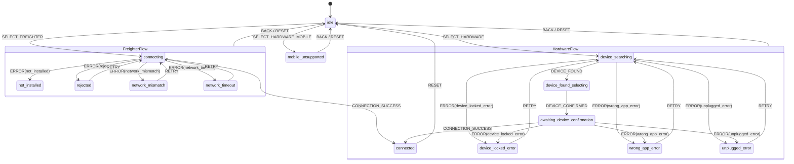

# Wallet State Machine (`useWalletStateMachine`)

This document defines and formalizes the finite state machine driving the wallet connection flow in Fluxora (`src/components/wallet-connect/useWalletStateMachine.ts`).

The value of a finite state machine is that **illegal transitions are impossible**, and that guarantee holds only if all states, events, and edges are written down, asserted, and verified against the implementation.

---

## 1. Overview & Architectural Invariants

The wallet state machine models every screen and interaction state of the wallet connection process as a discrete, named state. It replaces ad-hoc boolean flags with deterministic transitions driven by explicit events.

### Key Invariants
1. **Deterministic Reducer**: State transitions are pure functions of `(currentContext, event) => nextContext`.
2. **Rejection of Illegal Transitions**: Any event dispatched in a state where it is not legally defined is dropped (the context is returned unmodified). When asserted using `assertTransition`, an `IllegalTransitionError` is thrown.
3. **No Double-Submission**: The `isRequestInFlight` ref guard ensures that concurrent clicks or dispatches cannot trigger multiple connection attempts.
4. **Terminal Success Guard**: Once the machine enters the `connected` state, the user cannot navigate `BACK`. Only an explicit `RESET` (e.g. disconnect or closing the modal) can return the machine to `idle`.
5. **Context Isolation**: Extended state (`hardwareRetryTarget`) is preserved only during hardware error recovery flows and is strictly cleared (`null`) upon successful connection, retry resolution, or return to `idle`.

---

## 2. States

The machine contains **14 discrete states** categorized into four operational phases:

| State | Phase | Description | UI Representation |
|---|---|---|---|
| `idle` | Initial | Initial resting state. No connection attempt in progress. | Modal displaying wallet provider options (Freighter, Hardware, Albedo, WalletConnect). |
| `connecting` | In-Flight | Freighter wallet connection initiated and pending user approval. | Spinner active on Freighter option; description set to "Connecting..."; interaction disabled. |
| `not_installed` | Error | Freighter browser extension was not detected. | Notice prompting the user to download and install Freighter from the extension store. |
| `rejected` | Error | User rejected or cancelled the connection request in Freighter. | Error notice with a "Retry Connection" button and a "Back" button. |
| `network_mismatch` | Error | Connected Freighter account network does not match required network. | Error notice advising user to switch network with "Check Network Again" retry button. |
| `network_timeout` | Error | Connection attempt timed out waiting for extension response. | Error notice advising user to check extension with "Retry Connection" button. |
| `device_searching` | In-Flight | WebUSB scan in progress looking for connected Ledger or Trezor devices. | Scanning animation with status indicator and cancel button. |
| `device_found_selecting` | In-Flight | Hardware device found; user configuring device and derivation path. | Device selection card with derivation path dropdown and confirmation button. |
| `awaiting_device_confirmation` | In-Flight | Waiting for physical confirmation on hardware device screen. | Prompt instructing user to review and approve public key export on hardware device. |
| `device_locked_error` | Error | Hardware device is locked with PIN. | Instructions to unlock device with PIN and retry. |
| `wrong_app_error` | Error | Required Stellar application is not open on hardware device. | Instructions to open Stellar app on hardware device and retry. |
| `unplugged_error` | Error | USB cable disconnected or communication lost. | Instructions to reconnect USB cable and retry. |
| `mobile_unsupported` | Error | Hardware wallet flow initiated on a mobile viewport/browser. | Informational error explaining WebUSB is unavailable on mobile; suggests WalletConnect. |
| `connected` | Terminal | Wallet successfully connected; public key retrieved and session active. | Success screen or modal closes; active wallet pill displayed in navigation. |

---

## 3. Events

| Event | Payload | Purpose | Valid Source States |
|---|---|---|---|
| `SELECT_FREIGHTER` | None | User initiates connection to Freighter extension. | `idle` |
| `SELECT_HARDWARE` | None | User initiates hardware wallet connection on desktop. | `idle` |
| `SELECT_HARDWARE_MOBILE` | None | User attempts hardware wallet connection on mobile. | `idle` |
| `DEVICE_FOUND` | None | WebUSB scan successfully located a hardware device. | `device_searching` |
| `DEVICE_CONFIRMED` | None | User confirmed device selection and derivation path. | `device_found_selecting` |
| `CONNECTION_SUCCESS` | None | Wallet connection completed successfully. | `connecting`, `awaiting_device_confirmation` |
| `ERROR` | `{ error: FreighterErrorState \| HardwareErrorState }` | Informs machine of failure during connection. | `connecting`, `device_searching`, `awaiting_device_confirmation` |
| `RETRY` | None | Re-attempt connection after a recoverable error. | `rejected`, `network_mismatch`, `network_timeout`, `device_locked_error`, `wrong_app_error`, `unplugged_error` |
| `BACK` | None | Return to `idle` from a sub-flow or error screen. | Any state except `idle` and `connected` |
| `RESET` | None | Unconditionally reset machine context to initial `idle`. | All states |

---

## 4. State Topology Diagrams

### Overall Topology


---

## 5. Complete Transition Edge Matrix

Below is the exhaustive registry of all legal transition edges `(From State, Event) => To State`:

| # | From State | Event | Target State | Context Modification | Notes |
|---|---|---|---|---|---|
| 1 | `idle` | `SELECT_FREIGHTER` | `connecting` | `hardwareRetryTarget: null` | Starts Freighter handshake |
| 2 | `idle` | `SELECT_HARDWARE` | `device_searching` | `hardwareRetryTarget: null` | Starts USB device discovery |
| 3 | `idle` | `SELECT_HARDWARE_MOBILE` | `mobile_unsupported` | `hardwareRetryTarget: null` | Mobile guard |
| 4 | `idle` | `RESET` | `idle` | `hardwareRetryTarget: null` | Idempotent reset |
| 5 | `connecting` | `CONNECTION_SUCCESS` | `connected` | `hardwareRetryTarget: null` | Wallet connected |
| 6 | `connecting` | `ERROR (not_installed)` | `not_installed` | `hardwareRetryTarget: null` | Extension absent |
| 7 | `connecting` | `ERROR (rejected)` | `rejected` | `hardwareRetryTarget: null` | User cancelled |
| 8 | `connecting` | `ERROR (network_mismatch)` | `network_mismatch` | `hardwareRetryTarget: null` | Network wrong |
| 9 | `connecting` | `ERROR (network_timeout)` | `network_timeout` | `hardwareRetryTarget: null` | RPC/wallet timeout |
| 10 | `connecting` | `BACK` | `idle` | `hardwareRetryTarget: null` | Cancels request |
| 11 | `connecting` | `RESET` | `idle` | `hardwareRetryTarget: null` | Resets flow |
| 12 | `not_installed` | `BACK` | `idle` | `hardwareRetryTarget: null` | Back to provider list |
| 13 | `not_installed` | `RESET` | `idle` | `hardwareRetryTarget: null` | Resets flow |
| 14 | `rejected` | `RETRY` | `connecting` | `hardwareRetryTarget: null` | Re-triggers Freighter prompt |
| 15 | `rejected` | `BACK` | `idle` | `hardwareRetryTarget: null` | Back to provider list |
| 16 | `rejected` | `RESET` | `idle` | `hardwareRetryTarget: null` | Resets flow |
| 17 | `network_mismatch` | `RETRY` | `connecting` | `hardwareRetryTarget: null` | Re-checks network |
| 18 | `network_mismatch` | `BACK` | `idle` | `hardwareRetryTarget: null` | Back to provider list |
| 19 | `network_mismatch` | `RESET` | `idle` | `hardwareRetryTarget: null` | Resets flow |
| 20 | `network_timeout` | `RETRY` | `connecting` | `hardwareRetryTarget: null` | Re-attempts connection |
| 21 | `network_timeout` | `BACK` | `idle` | `hardwareRetryTarget: null` | Back to provider list |
| 22 | `network_timeout` | `RESET` | `idle` | `hardwareRetryTarget: null` | Resets flow |
| 23 | `device_searching` | `DEVICE_FOUND` | `device_found_selecting` | `hardwareRetryTarget: unchanged` | Device detected |
| 24 | `device_searching` | `ERROR (device_locked_error)` | `device_locked_error` | `hardwareRetryTarget: "device_searching"` | Device locked |
| 25 | `device_searching` | `ERROR (wrong_app_error)` | `wrong_app_error` | `hardwareRetryTarget: "device_searching"` | Wrong app active |
| 26 | `device_searching` | `ERROR (unplugged_error)` | `unplugged_error` | `hardwareRetryTarget: "device_searching"` | USB disconnected |
| 27 | `device_searching` | `BACK` | `idle` | `hardwareRetryTarget: null` | Cancels search |
| 28 | `device_searching` | `RESET` | `idle` | `hardwareRetryTarget: null` | Resets flow |
| 29 | `device_found_selecting` | `DEVICE_CONFIRMED` | `awaiting_device_confirmation` | `hardwareRetryTarget: unchanged` | Derivation confirmed |
| 30 | `device_found_selecting` | `BACK` | `idle` | `hardwareRetryTarget: null` | Back to provider list |
| 31 | `device_found_selecting` | `RESET` | `idle` | `hardwareRetryTarget: null` | Resets flow |
| 32 | `awaiting_device_confirmation` | `CONNECTION_SUCCESS` | `connected` | `hardwareRetryTarget: null` | Key confirmed on device |
| 33 | `awaiting_device_confirmation` | `ERROR (device_locked_error)` | `device_locked_error` | `hardwareRetryTarget: "device_searching"` | Device locked |
| 34 | `awaiting_device_confirmation` | `ERROR (wrong_app_error)` | `wrong_app_error` | `hardwareRetryTarget: "device_searching"` | Wrong app active |
| 35 | `awaiting_device_confirmation` | `ERROR (unplugged_error)` | `unplugged_error` | `hardwareRetryTarget: "device_searching"` | USB disconnected |
| 36 | `awaiting_device_confirmation` | `BACK` | `idle` | `hardwareRetryTarget: null` | Cancels confirmation |
| 37 | `awaiting_device_confirmation` | `RESET` | `idle` | `hardwareRetryTarget: null` | Resets flow |
| 38 | `device_locked_error` | `RETRY` | `device_searching` | `hardwareRetryTarget: null` | Restarts device scan |
| 39 | `device_locked_error` | `BACK` | `idle` | `hardwareRetryTarget: null` | Back to provider list |
| 40 | `device_locked_error` | `RESET` | `idle` | `hardwareRetryTarget: null` | Resets flow |
| 41 | `wrong_app_error` | `RETRY` | `device_searching` | `hardwareRetryTarget: null` | Restarts device scan |
| 42 | `wrong_app_error` | `BACK` | `idle` | `hardwareRetryTarget: null` | Back to provider list |
| 43 | `wrong_app_error` | `RESET` | `idle` | `hardwareRetryTarget: null` | Resets flow |
| 44 | `unplugged_error` | `RETRY` | `device_searching` | `hardwareRetryTarget: null` | Restarts device scan |
| 45 | `unplugged_error` | `BACK` | `idle` | `hardwareRetryTarget: null` | Back to provider list |
| 46 | `unplugged_error` | `RESET` | `idle` | `hardwareRetryTarget: null` | Resets flow |
| 47 | `mobile_unsupported` | `BACK` | `idle` | `hardwareRetryTarget: null` | Back to provider list |
| 48 | `mobile_unsupported` | `RESET` | `idle` | `hardwareRetryTarget: null` | Resets flow |
| 49 | `connected` | `RESET` | `idle` | `hardwareRetryTarget: null` | Disconnect session |

---

## 6. Illegal Transitions & Rejection Rules

Any `(state, event)` pair not listed in the table above is **illegal**.

### Rejection Semantics
1. **Silent Rejection in Pure Reducer**:
   Calling `walletMachineReducer(ctx, illegalEvent)` returns `ctx` strictly identical by reference:
   ```ts
   const nextCtx = walletMachineReducer(ctx, illegalEvent);
   expect(nextCtx).toBe(ctx);
   ```
2. **Explicit Assertion via `assertTransition`**:
   Calling `assertTransition(ctx, illegalEvent)` verifies legality via `isLegalTransition(ctx.state, illegalEvent)` and throws an `IllegalTransitionError`:
   ```ts
   expect(() => assertTransition(ctx, illegalEvent)).toThrow(IllegalTransitionError);
   ```

### Critical Disallowed Behaviors
- **No Concurrent Handshake**: `SELECT_FREIGHTER` and `SELECT_HARDWARE` cannot be dispatched once already connecting or searching.
- **No Direct Jump to Connected**: `CONNECTION_SUCCESS` cannot occur from `idle`, `not_installed`, `device_searching`, or error states.
- **No Back Navigation from Connected**: Dispatched `BACK` from `connected` is rejected; users must explicitly disconnect via `RESET`.
- **No Direct Retry from Uninstalled**: `not_installed` does not accept `RETRY` because the user must first install the extension outside the application before navigating back to retry.
- **Strict Error Scoping**: Hardware errors are rejected while in Freighter connecting, and Freighter errors are rejected while in hardware flows.

---

## 7. Testing & Verification

The state machine is asserted across three distinct dimensions in `__tests__/useWalletStateMachine.test.ts`:
1. **Unit Coverage of Every Legal Transition**: All 49 transitions are individually driven and verified for state change and context updates.
2. **Exhaustive Matrix Assertion of Illegal Transitions**: Every state (14) crossed with every event type is tested. Illegal combinations are confirmed to be rejected by the reducer and rejected by `assertTransition`.
3. **Sequential Flow Driving**: Complete end-to-end user journeys are driven in sequence, asserting that at no point in any flow can an illegal state be entered.
